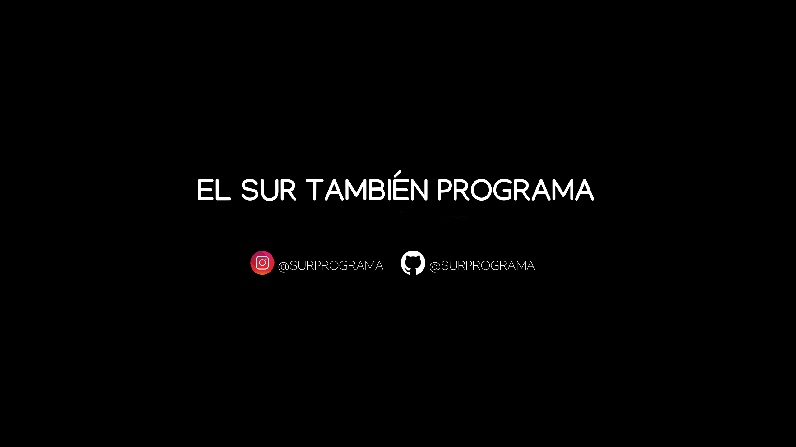

# El Sur también programa - piezas gráficas

## Licencia
  
Esta obra fue elaborada por [Federico Aloi](https://github.com/faloi) y publicada bajo una [Licencia Creative Commons Atribución-CompartirIgual 4.0 Internacional][cc-by-sa].

[![CC BY-SA 4.0][cc-by-sa-image]][cc-by-sa]

[cc-by-sa]: https://creativecommons.org/licenses/by-sa/4.0/deed.es
[cc-by-sa-image]: https://licensebuttons.net/l/by-sa/4.0/88x31.png

### Créditos

:paintbrush: Plantillas diseñadas por [Alejandro Rocha Cruz](https://twitter.com/diablodromo).

:camera_flash: Imágenes descargadas de [Unsplash](https://unsplash.com/).
